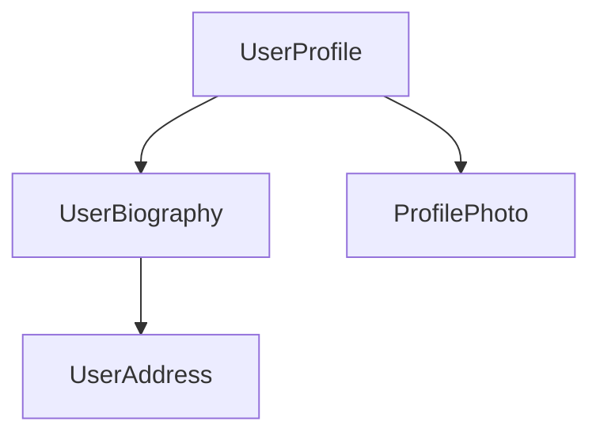

## Introduction

1. This guide covers a range of style conventions for Angular application code. These recommendations
are not required for Angular to work, but instead establish a set of coding practices that promote
consistency across the Angular ecosystem. A consistent set of practices makes it easier to share
code and move between projects.

2. This guide does _not_ cover TypeScript or general coding practices unrelated to Angular. For
TypeScript, check
out [Google's TypeScript style guide](https://google.github.io/styleguide/tsguide.html).

### When in doubt, prefer consistency

1. Whenever you encounter a situation in which these rules contradict the style of a particular file,
prioritize maintaining consistency within a file. Mixing different style conventions in a single
file creates more confusion than diverging from the recommendations in this guide.

## Naming

### Separate words in file names with hyphens

1. Separate words within a file name with hyphens (`-`). For example, a component named `UserProfile`
has a file name `user-profile.ts`.

### Use the same name for a file's tests with `.spec` at the end

1. For unit tests, end file names with `.spec.ts`. For example, the unit test file for
the `UserProfile` component has the file name `user-profile.spec.ts`.

### Match file names to the TypeScript identifier within

1. File names should generally describe the contents of the code in the file. When the file contains a
TypeScript class, the file name should reflect that class name. For example, a file containing a
component named `UserProfile` has the name `user-profile.ts`.

2. If the file contains more than one primary namable identifier, choose a name that describes the
common theme to the code within. If the code in a file does not fit within a common theme or feature
area, consider breaking the code up into different files. Do not use overly generic file names
like `helpers.ts`, `utils.ts`, or `common.ts`.

### Use the same file name for a component's TypeScript, template, and styles

1. Components typically consist of one TypeScript file, one template file, and one style file. These
files should share the same name with different file extensions. For example, a `UserProfile`
component can have the files `user-profile.ts`, `user-profile.html`, and `user-profile.css`.

2. If a component has more than one style file, append the name with additional words that describe the
styles specific to that file. For example, `UserProfile` might have style
files `user-profile-settings.css` and `user-profile-subscription.css`.

## Project structure

### All the application's code goes in a directory named `src`

1. All of your Angular UI code (TypeScript, HTML, and styles) should live inside a directory
named `src`. Code that's not related to UI, such as configuration files or scripts, should live
outside the `src` directory.

2. This keeps the root application directory consistent between different Angular projects and creates
a clear separation between UI code and other code in your project.

### Bootstrap your application in a file named `main.ts` directly inside `src`

1. The code to start up, or **bootstrap**, an Angular application should always live in a file
named `main.ts`. This represents the primary entry point to the application.

### Group closely related files together in the same directory

1. Angular components consist of a TypeScript file and, optionally, a template and one or more style
files. You should group these together in the same directory.

2. Unit tests should live in the same directory as the code-under-test. Do not collect unrelated
tests into a single `tests` directory.

### Organize your project by feature areas

1. Organize your project into subdirectories based on the features of your application or common themes
to the code in those directories. For example, the project structure for a movie theater site,
MovieReel, might look like this:

```
src/
├─ movie-reel/
│ ├─ show-times/
│ │ ├─ film-calendar/
│ │ ├─ film-details/
│ ├─ reserve-tickets/
│ │ ├─ payment-info/
│ │ ├─ purchase-confirmation/
```

2. Do not create subdirectories based on the type of code that lives in those directories. For
example, do not create directories like `components`, `directives`, and `services`.

3. Do not put so many files into one directory that it becomes hard to read or navigate. As the
number of files in a directory grows, consider splitting further into additional sub-directories.

### One concept per file

1. Prefer focusing source files on a single _concept_. For Angular classes specifically, this usually
means one component, directive, or service per file. However, it's okay if a file contains more than
one component or directive if your classes are relatively small and they tie together as part of a
single concept.

2. When in doubt, go with the approach that leads to smaller files.

## Dependency injection

### Prefer the `inject` function over constructor parameter injection

1. Prefer using the [`inject`](/api/core/inject) function over injecting constructor parameters. The [`inject`](/api/core/inject) function works the same way as constructor parameter injection, but offers several style advantages:

- [`inject`](/api/core/inject) is generally more readable, especially when a class injects many dependencies.
- It's more syntactically straightforward to add comments to injected dependencies
- [`inject`](/api/core/inject) offers better type inference.
- When targeting ES2022+ with [`useDefineForClassFields`](https://www.typescriptlang.org/tsconfig/#useDefineForClassFields), you can avoid separating field declaration and initialization when fields read on injected dependencies.

2. [You can refactor existing code to `inject` with an automatic tool](reference/migrations/inject-function).

## Components and directives

### Choosing component selectors

1. See
the [Components guide for details on choosing component selectors](guide/components/selectors#choosing-a-selector).

### Naming component and directive members

1. See the Components guide for details
on [naming input properties](guide/components/inputs#choosing-input-names)
and [naming output properties](guide/components/outputs#choosing-event-names).

### Choosing directive selectors

1. Directives should use the
same [application-specific prefix](guide/components/selectors#selector-prefixes)
as your components.

2. When using an attribute selector for a directive, use a camelCase attribute name. For example, if
your application is named "MovieReel" and you build a directive that adds a tooltip to an element,
you might use the selector `[mrTooltip]`.

### Group Angular-specific properties before methods

1. Components and directives should group Angular-specific properties together, typically near the top
of the class declaration. This includes injected dependencies, inputs, outputs, and queries. Define
these and other properties before the class's methods.

2. This practice makes it easier to find the class's template APIs and dependencies.

### Keep components and directives focused on presentation

1. Code inside your components and directives should generally relate to the UI shown on the page. For
code that makes sense on its own, decoupled from the UI, prefer refactoring to other files. For
example, you can factor form validation rules or data transformations into separate functions or
classes.

### Do not use overly complex logic in templates

1. Angular templates are designed to
accommodate [JavaScript-like expressions](guide/templates/expression-syntax).
You should take advantage of these expressions to capture relatively straightforward logic directly
in template expressions.

2. When the code in a template gets too complex, refactor logic into the TypeScript code (typically with a [computed](guide/signals#computed-signals)).

3. There's no one hard-and-fast rule that determines what constitutes "complex". Use your best
judgement.

### Use `protected` on class members that are only used by a component's template

1. A component class's public members intrinsically define a public API that's accessible via
dependency injection and [queries](guide/components/queries). Prefer `protected`
access for any members that are meant to be read from the component's template.

```ts
@Component({
  ...,
  template: `<p>{{ fullName() }}</p>`,
})
export class UserProfile {
  firstName = input();
  lastName = input();

// `fullName` is not part of the component's public API, but is used in the template.
  protected fullName = computed(() => `${this.firstName()} ${this.lastName()}`);
}
```

### Use `readonly` for properties that shouldn't change

1. Mark component and directive properties initialized by Angular as `readonly`. This includes
properties initialized by `input`, `model`, `output`, and queries. The readonly access modifier
ensures that the value set by Angular is not overwritten.

```ts
@Component({
  /*...*/
})
export class UserProfile {
  readonly userId = input();
  readonly userSaved = output();
  readonly userName = model();
}
```

2. For components and directives that use the decorator-based `@Input`, `@Output`, and query APIs, this
advice applies to output properties and queries, but not input properties.

```ts
@Component({
  /*...*/
})
export class UserProfile {
  @Output() readonly userSaved = new EventEmitter<void>();
  @ViewChildren(PaymentMethod) readonly paymentMethods?: QueryList<PaymentMethod>;
}
```

### Prefer `class` and `style` over `ngClass` and `ngStyle`

1. Prefer `class` and `style` bindings over using the [`NgClass`](/api/common/NgClass) and [`NgStyle`](/api/common/NgStyle) directives.

```html
{prefer}
<div [class.admin]="isAdmin" [class.dense]="density === 'high'">
  <div [style.color]="textColor" [style.background-color]="backgroundColor">
    <!-- OR -->
    <div [class]="{admin: isAdmin, dense: density === 'high'}">
      <div [style]="{'color': textColor, 'background-color': backgroundColor}"></div>
    </div>
  </div>
</div>
```

```html
{avoid}
<div [ngClass]="{admin: isAdmin, dense: density === 'high'}">
  <div [ngStyle]="{'color': textColor, 'background-color': backgroundColor}"></div>
</div>
```

2. Both `class` and `style` bindings use a more straightforward syntax that aligns closely with
standard HTML attributes. This makes your templates easier to read and understand, especially for
developers familiar with basic HTML.

3. Additionally, the `NgClass` and `NgStyle` directives incur an additional performance cost compared
to the built-in `class` and `style` binding syntax.

4. For more details, refer to the [bindings guide](/guide/templates/binding#css-class-and-style-property-bindings)

### Name event handlers for what they _do_, not for the triggering event

1. Prefer naming event handlers for the action they perform rather than for the triggering event:

```html
{prefer}
<button (click)="saveUserData()">Save</button>
```

```html
{avoid}
<button (click)="handleClick()">Save</button>
```

2. Using meaningful names like this makes it easier to tell what an event does from reading the
template.

3. For keyboard events, you can use Angular's key event modifiers with specific handler names:

```html
<textarea (keydown.control.enter)="commitNotes()" (keydown.control.space)="showSuggestions()">
```

4. Sometimes, event handling logic is especially long or complex, making it impractical to declare a
single well-named handler. In these cases, it's fine to fall back to a name like 'handleKeydown' and
then delegate to more specific behaviors based on the event details:

```ts
@Component({
  /*...*/
})
class RichText {
  handleKeydown(event: KeyboardEvent) {
    if (event.ctrlKey) {
      if (event.key === 'B') {
        this.activateBold();
      } else if (event.key === 'I') {
        this.activateItalic();
      }
      // ...
    }
  }
}
```

### Keep lifecycle methods simple

1. Do not put long or complex logic inside lifecycle hooks like `ngOnInit`. Instead, prefer creating
well-named methods to contain that logic and then _call those methods_ in your lifecycle hooks.
Lifecycle hook names describe _when_ they run, meaning that the code inside doesn't have a
meaningful name that describes what the code inside is doing.

```ts
{prefer}
ngOnInit() {
  this.startLogging();
  this.runBackgroundTask();
}
```

```ts
{avoid}
ngOnInit() {
  this.logger.setMode('info');
  this.logger.monitorErrors();
  // ...and all the rest of the code that would be unrolled from these methods.
}
```

### Use lifecycle hook interfaces

1. Angular provides a TypeScript interface for each lifecycle method. When adding a lifecycle hook to
your class, import and `implement` these interfaces to ensure that the methods are named correctly.

```ts
import {Component, OnInit} from '@angular/core';

@Component({
  /*...*/
})
export class UserProfile implements OnInit {
  // The `OnInit` interface ensures this method is named correctly.
  ngOnInit() {
    /* ... */
  }
}
```

2. Components are the main building blocks of Angular applications. Each component represents a part of a larger web page. Organizing an application into components helps provide structure to your project, clearly separating code into specific parts that are easy to maintain and grow over time.

## Defining a component

1. Every component has a few main parts:

    1. A `@Component`[decorator](https://www.typescriptlang.org/docs/handbook/decorators.html) that contains some configuration used by Angular.
    2. An HTML template that controls what renders into the DOM.
    3. A [CSS selector](https://developer.mozilla.org/docs/Learn/CSS/Building_blocks/Selectors) that defines how the component is used in HTML.
    4. A TypeScript class with behaviors, such as handling user input or making requests to a server.

2. Here is a simplified example of a `UserProfile` component.

```typescript
// user-profile.ts
@Component({
  selector: 'user-profile',
  template: `
    <h1>User profile</h1>
    <p>This is the user profile page</p>
  `,
})
export class UserProfile {
  /* Your component code goes here */
}
```

3. The `@Component` decorator also optionally accepts a `styles` property for any CSS you want to apply to your template:

```typescript
// user-profile.ts
@Component({
  selector: 'user-profile',
  template: `
    <h1>User profile</h1>
    <p>This is the user profile page</p>
  `,
  styles: `
    h1 {
      font-size: 3em;
    }
  `,
})
export class UserProfile {
  /* Your component code goes here */
}
```

### Separating HTML and CSS into separate files

1. You can define a component's HTML and CSS in separate files using `templateUrl` and `styleUrl`:

```typescript
// user-profile.ts
@Component({
  selector: 'user-profile',
  templateUrl: 'user-profile.html',
  styleUrl: 'user-profile.css',
})
export class UserProfile {
  // Component behavior is defined in here
}
```

```html
<!-- user-profile.html -->
<h1>User profile</h1>
<p>This is the user profile page</p>
```

```css
/* user-profile.css */
h1 {
  font-size: 3em;
}
```

## Using components

1. You build an application by composing multiple components together. For example, if you are building a user profile page, you might break the page up into several components like this:



2. Here, the `UserProfile` component uses several other components to produce the final page.

3. To import and use a component, you need to:

    1. In your component's TypeScript file, add an `import` statement for the component you want to use.
    2. In your `@Component` decorator, add an entry to the `imports` array for the component you want to use.
    3. In your component's template, add an element that matches the selector of the component you want to use.

4. Here's an example of a `UserProfile` component importing a `ProfilePhoto` component:

```typescript
// user-profile.ts
import {ProfilePhoto} from 'profile-photo.ts';

@Component({
  selector: 'user-profile',
  imports: [ProfilePhoto],
  template: `
    <h1>User profile</h1>
    <profile-photo />
    <p>This is the user profile page</p>
  `,
})
export class UserProfile {
  // Component behavior is defined in here
}
```

5. TIP: Want to know more about Angular components? See the [In-depth Components guide](guide/components) for the full details.

## Next Step

1. Now that you know how components work in Angular, it's time to learn how we add and manage dynamic data in our application.
# Component selectors

1. TIP: This guide assumes you've already read the [Essentials Guide](essentials). Read that first if you're new to Angular.

2. Every component defines
a [CSS selector](https://developer.mozilla.org/docs/Web/CSS/CSS_selectors) that determines how
the component is used:

```typescript
{highlight: [2]}
@Component({
  selector: 'profile-photo',
  ...
})
export class ProfilePhoto { }
```

3. You use a component by creating a matching HTML element in the templates of _other_ components:

```typescript
{highlight: [3]}
@Component({
  template: `
    <profile-photo />
    <button>Upload a new profile photo</button>`,
  ...,
})
export class UserProfile { }
```

4. **Angular matches selectors statically at compile-time**. Changing the DOM at run-time, either via
Angular bindings or with DOM APIs, does not affect the components rendered.

5. **An element can match exactly one component selector.** If multiple component selectors match a
single element, Angular reports an error.

6. **Component selectors are case-sensitive.**

## Types of selectors

1. Angular supports a limited subset
of [basic CSS selector types](https://developer.mozilla.org/docs/Web/CSS/CSS_Selectors) in
component selectors:

| **Selector type**  | **Description**                                                                                                 | **Examples**                  |
| ------------------ | --------------------------------------------------------------------------------------------------------------- | ----------------------------- |
| Type selector      | Matches elements based on their HTML tag name, or node name.                                                    | `profile-photo`               |
| Attribute selector | Matches elements based on the presence of an HTML attribute and, optionally, an exact value for that attribute. | `[dropzone]` `[type="reset"]` |
| Class selector     | Matches elements based on the presence of a CSS class.                                                          | `.menu-item`                  |

2. For attribute values, Angular supports matching an exact attribute value with the equals (`=`)
operator. Angular does not support other attribute value operators.

3. Angular component selectors do not support combinators, including
the [descendant combinator](https://developer.mozilla.org/docs/Web/CSS/Descendant_combinator)
or [child combinator](https://developer.mozilla.org/docs/Web/CSS/Child_combinator).

4. Angular component selectors do not support
specifying [namespaces](https://developer.mozilla.org/docs/Web/SVG/Namespaces_Crash_Course).

### The `:not` pseudo-class

1. Angular supports [the `:not` pseudo-class](https://developer.mozilla.org/docs/Web/CSS/:not).
You can append this pseudo-class to any other selector to narrow which elements a component's
selector matches. For example, you could define a `[dropzone]` attribute selector and prevent
matching `textarea` elements:

```typescript
{highlight: [2]}
@Component({
  selector: '[dropzone]:not(textarea)',
  ...
})
export class DropZone { }
```

2. Angular does not support any other pseudo-classes or pseudo-elements in component selectors.

### Combining selectors

1. You can combine multiple selectors by concatenating them. For example, you can match `<button>`
elements that specify `type="reset"`:

```typescript
{highlight: [2]}
@Component({
  selector: 'button[type="reset"]',
  ...
})
export class ResetButton { }
```

2. You can also define multiple selectors with a comma-separated list:

```typescript
{highlight: [2]}
@Component({
  selector: 'drop-zone, [dropzone]',
  ...
})
export class DropZone { }
```

3. Angular creates a component for each element that matches _any_ of the selectors in the list.

## Choosing a selector

1. The vast majority of components should use a custom element name as their selector. All custom
element names should include a hyphen as described
by [the HTML specification](https://html.spec.whatwg.org/multipage/custom-elements.html#valid-custom-element-name).
By default, Angular reports an error if it encounters a custom tag name that does not match any
available components, preventing bugs due to mistyped component names.

2. See [Advanced component configuration](guide/components/advanced-configuration) for details on
using [native custom elements](https://developer.mozilla.org/docs/Web/Web_Components) in
Angular templates.

### Selector prefixes

1. The Angular team recommends using a short, consistent prefix for all the custom components
defined inside your project. For example, if you were to build YouTube with Angular, you might
prefix your components with `yt-`, with components like `yt-menu`, `yt-player`, etc. Namespacing
your selectors like this makes it immediately clear where a particular component comes from. By
default, the Angular CLI uses `app-`.

2. IMPORTANT: Angular uses the `ng` selector prefix for its own framework APIs. Never use `ng` as a selector prefix for your own custom components.

### When to use an attribute selector

1. You should consider an attribute selector when you want to create a component on a standard native
element. For example, if you want to create a custom button component, you can take advantage of the
standard `<button>` element by using an attribute selector:

```typescript
{highlight: [2]}
@Component({
  selector: 'button[yt-upload]',
   ...
})
export class YouTubeUploadButton { }
```

2. This approach allows consumers of the component to directly use all the element's standard APIs
without extra work. This is especially valuable for ARIA attributes such as `aria-label`.

3. Angular does not report errors when it encounters custom attributes that don't match an available
component. When using components with attribute selectors, consumers may forget to import the
component or its NgModule, resulting in the component not rendering.
See [Importing and using components](guide/components#imports-in-the-component-decorator) for more information.

4. Components that define attribute selectors should use lowercase, dash-case attributes. You can
follow the same prefixing recommendation described above.
# Styling components

1. TIP: This guide assumes you've already read the [Essentials Guide](essentials). Read that first if you're new to Angular.

2. Components can optionally include CSS styles that apply to that component's DOM:

```typescript
{highlight:[4]}
@Component({
  selector: 'profile-photo',
  template: ``,
  styles: `
    img {
      border-radius: 50%;
    }
  `,
})
export class ProfilePhoto {}
```

3. You can also choose to write your styles in separate files:

```typescript
{highlight:[4]}
@Component({
  selector: 'profile-photo',
  templateUrl: 'profile-photo.html',
  styleUrl: 'profile-photo.css',
})
export class ProfilePhoto {}
```

4. When Angular compiles your component, these styles are emitted with your component's JavaScript
output. This means that component styles participate in the JavaScript module system. When you
render an Angular component, the framework automatically includes its associated styles, even when
lazy-loading a component.

5. Angular works with any tool that outputs CSS,
including [Sass](https://sass-lang.com), [less](https://lesscss.org),
and [stylus](https://stylus-lang.com).

## Style scoping

1. Every component has a **view encapsulation** setting that determines how the framework scopes a
component's styles. There are four view encapsulation modes: `Emulated`, `ShadowDom`, `ExperimentalIsolatedShadowDom`, and `None`.
You can specify the mode in the `@Component` decorator:

```typescript
{highlight:[3]}
@Component({
  ...,
  encapsulation: ViewEncapsulation.None,
})
export class ProfilePhoto { }
```
#### `::ng-deep`

1. Angular's emulated encapsulation mode supports a custom pseudo class, `::ng-deep`.
**The Angular team strongly discourages new use of `::ng-deep`**. These APIs remain
exclusively for backwards compatibility.

## Defining styles in templates

1. You can use the `<style>` element in a component's template to define additional styles. The component's view encapsulation mode applies to styles defined this way.

2. Angular does not support bindings inside of style elements.

## Referencing external style files

1. Component templates can
use [the `<link>` element](https://developer.mozilla.org/docs/Web/HTML/Element/link) to reference CSS files. Additionally, your CSS may use [the `@import`at-rule](https://developer.mozilla.org/docs/Web/CSS/@import) to reference
CSS files. Angular treats these references as _external_ styles. External styles are not affected by emulated view encapsulation.
# Accepting data with input properties

1. TIP: This guide assumes you've already read the [Essentials Guide](essentials). Read that first if you're new to Angular.

2. TIP: If you're familiar with other web frameworks, input properties are similar to _props_.

3. When you use a component, you commonly want to pass some data to it. A component specifies the data that it accepts by declaring
**inputs**:

```ts
{highlight:[8]}
import {Component, input} from '@angular/core';

@Component({
  /*...*/
})
export class CustomSlider {
  // Declare an input named 'value' with a default value of zero.
  value = input(0);
}
```

4. This lets you bind to the property in a template:

```html
<custom-slider [value]="50" />
```

5. If an input has a default value, TypeScript infers the type from the default value:

```ts
@Component({
  /*...*/
})
export class CustomSlider {
  // TypeScript infers that this input is a number, returning InputSignal<number>.
  value = input(0);
}
```

6. You can explicitly declare a type for the input by specifying a generic parameter to the function.

7. If an input without a default value is not set, its value is `undefined`:

```ts
@Component({
  /*...*/
})
export class CustomSlider {
  // Produces an InputSignal<number | undefined> because `value` may not be set.
  value = input<number>();
}
```

8. **Angular records inputs statically at compile-time**. Inputs cannot be added or removed at run-time.

9. The `input` function has special meaning to the Angular compiler. **You can exclusively call `input` in component and directive property initializers.**

10. When extending a component class, **inputs are inherited by the child class.**

11. **Input names are case-sensitive.**

## Reading inputs

1. The `input` function returns an `InputSignal`. You can read the value by calling the signal:

```ts
{highlight:[11]}
import {Component, input, computed} from '@angular/core';

@Component({
  /*...*/
})
export class CustomSlider {
  // Declare an input named 'value' with a default value of zero.
  value = input(0);

  // Create a computed expression that reads the value input
  label = computed(() => `The slider's value is ${this.value()}`);
}
```

2. Signals created by the `input` function are read-only.

## Required inputs

1. You can declare that an input is `required` by calling `input.required` instead of `input`:

```ts
{highlight:[6]}
@Component({
  /*...*/
})
export class CustomSlider {
  // Declare a required input named value. Returns an `InputSignal<number>`.
  value = input.required<number>();
}
```

2. Angular enforces that required inputs _must_ be set when the component is used in a template. If you try to use a component without specifying all of its required inputs, Angular reports an error at build-time.

3. Required inputs do not automatically include `undefined` in the generic parameter of the returned `InputSignal`.

## Configuring inputs

1. The `input` function accepts a config object as a second parameter that lets you change the way that input works.

### Input transforms

You can specify a `transform` function to change the value of an input when it's set by Angular.

```ts
{highlight:[6]}
@Component({
  selector: 'custom-slider',
  /*...*/
})
export class CustomSlider {
  label = input('', {transform: trimString});
}

function trimString(value: string | undefined): string {
  return value?.trim() ?? '';
}
```

```html
<custom-slider [label]="systemVolume" />
```

2. In the example above, whenever the value of `systemVolume` changes, Angular runs `trimString` and sets `label` to the result.

3. The most common use-case for input transforms is to accept a wider range of value types in templates, often including `null` and `undefined`.

4. **Input transform function must be statically analyzable at build-time.** You cannot set transform functions conditionally or as the result of an expression evaluation.

5. **Input transform functions should always be [pure functions](https://en.wikipedia.org/wiki/Pure_function).** Relying on state outside the transform function can lead to unpredictable behavior.

#### Type checking

1. When you specify an input transform, the type of the transform function's parameter determines the types of values that can be set to the input in a template.

```ts
@Component({
  /*...*/
})
export class CustomSlider {
  widthPx = input('', {transform: appendPx});
}

function appendPx(value: number): string {
  return `${value}px`;
}
```

2. In the example above, the `widthPx` input accepts a `number` while the `InputSignal` property returns a `string`.

#### Built-in transformations

1. Angular includes two built-in transform functions for the two most common scenarios: coercing values to boolean and numbers.

```ts
import {Component, input, booleanAttribute, numberAttribute} from '@angular/core';

@Component({
  /*...*/
})
export class CustomSlider {
  disabled = input(false, {transform: booleanAttribute});
  value = input(0, {transform: numberAttribute});
}
```

2. `booleanAttribute` imitates the behavior of standard HTML [boolean attributes](https://developer.mozilla.org/docs/Glossary/Boolean/HTML), where the
_presence_ of the attribute indicates a "true" value. However, Angular's `booleanAttribute` treats the literal string `"false"` as the boolean `false`.

3. `numberAttribute` attempts to parse the given value to a number, producing `NaN` if parsing fails.

### Input aliases

1. You can specify the `alias` option to change the name of an input in templates.

```ts
{highlight:[5]}
@Component({
  /*...*/
})
export class CustomSlider {
  value = input(0, {alias: 'sliderValue'});
}
```

```html
<custom-slider [sliderValue]="50" />
```

2. This alias does not affect usage of the property in TypeScript code.

3. While you should generally not alias inputs for components, this feature can be useful for renaming properties while preserving an alias for the original name or for avoiding collisions with the name of native DOM element properties.

## Model inputs

1. **Model inputs** are a special type of input that enable a component to propagate new values back to its parent component.

2. When creating a component, you can define a model input similarly to how you create a standard input.

3. Both types of input allow someone to bind a value into the property. However, **model inputs allow the component author to write values into the property**. If the property is bound with a two-way binding, the new value propagates to that binding.

```ts
@Component({
  /* ... */
})
export class CustomSlider {
  // Define a model input named "value".
  value = model(0);

  increment() {
    // Update the model input with a new value, propagating the value to any bindings.
    this.value.update((oldValue) => oldValue + 10);
  }
}

@Component({
  /* ... */
  // Using the two-way binding syntax means that any changes to the slider's
  // value automatically propagate back to the `volume` signal.
  // Note that this binding uses the signal *instance*, not the signal value.
  template: `<custom-slider [(value)]="volume" />`,
})
export class MediaControls {
  // Create a writable signal for the `volume` local state.
  volume = signal(0);
}
```

4. In the above example, the `CustomSlider` can write values into its `value` model input, which then propagates those values back to the `volume` signal in `MediaControls`. This binding keeps the values of `value` and `volume` in sync. Notice that the binding passes the `volume` signal instance, not the _value_ of the signal.

5. In other respects, model inputs work similarly to standard inputs. You can read the value by calling the signal function, including in [reactive contexts](guide/signals#reactive-contexts) like `computed` and `effect`.

6. See [Two-way binding](guide/templates/two-way-binding) for more details on two-way binding in templates.

### Two-way binding with plain properties

1. You can bind a plain JavaScript property to a model input.

```typescript
@Component({
  /* ... */
  // `value` is a model input.
  // The parenthesis-inside-square-brackets syntax (aka "banana-in-a-box") creates a two-way binding
  template: '<custom-slider [(value)]="volume" />',
})
export class MediaControls {
  protected volume = 0;
}
```

2. In the example above, the `CustomSlider` can write values into its `value` model input, which then propagates those values back to the `volume` property in `MediaControls`. This binding keeps the values of `value` and `volume` in sync.

### Implicit `change` events

1. When you declare a model input in a component or directive, Angular automatically creates a corresponding [output](guide/components/outputs) for that model. The output's name is the model input's name suffixed with "Change".

```ts
@Directive({
  /* ... */
})
export class CustomCheckbox {
  // This automatically creates an output named "checkedChange".
  // Can be subscribed to using `(checkedChange)="handler()"` in the template.
  checked = model(false);
}
```

2. Angular emits this change event whenever you write a new value into the model input by calling its `set` or `update` methods.

3. See [Custom events with outputs](guide/components/outputs) for more details on outputs.

### Customizing model inputs

1. You can mark a model input as required or provide an alias in the same way as a [standard input](guide/components/inputs).

2. Model inputs do not support input transforms, so do not attempt them.

### When to use model inputs

1. Use model inputs when you want a component to support two-way binding. This is typically appropriate when a component exists to modify a value based on user interaction. Most commonly, custom form controls, such as a date picker or combobox, should use model inputs for their primary value.

## Choosing input names

1. Do not choose input names that collide with properties on DOM elements like HTMLElement. Name collisions introduce confusion about whether the bound property belongs to the component or the DOM element.

2. Do not add prefixes for component inputs like you would with component selectors. Since a given element can only host one component, any custom properties can be assumed to belong to the component.

## Declaring inputs with the `@Input` decorator

1. While the Angular team recommends using the signal-based `input` function for new projects, the original decorator-based `@Input` API is fully supported.

2. You can alternatively declare component inputs by adding the `@Input` decorator to a property:

```ts
{highlight:[5]}
@Component({
  /*...*/
})
export class CustomSlider {
  @Input() value = 0;
}
```

3. Binding to an input is the same in both signal-based and decorator-based inputs:

```html
<custom-slider [value]="50" />
```

### Customizing decorator-based inputs

1. The `@Input` decorator accepts a config object that lets you change the way that input works.

#### Required inputs

1. You can specify the `required` option to enforce that a given input must always have a value.

```ts
{highlight:[5]}
@Component({
  /*...*/
})
export class CustomSlider {
  @Input({required: true}) value = 0;
}
```

2. If you try to use a component without specifying all of its required inputs, Angular reports an error at build-time.

#### Input transforms

1. You can specify a `transform` function to change the value of an input when it's set by Angular. This transform function works identically to transform functions for signal-based inputs described above.

```ts
{highlight:[6]}
@Component({
  selector: 'custom-slider',
  ...
})
export class CustomSlider {
  @Input({transform: trimString}) label = '';
}

function trimString(value: string | undefined) {
  return value?.trim() ?? '';
}
```

#### Input aliases

1. You can specify the `alias` option to change the name of an input in templates.

```ts
{highlight:[5]}
@Component({
  /*...*/
})
export class CustomSlider {
  @Input({alias: 'sliderValue'}) value = 0;
}
```

```html
<custom-slider [sliderValue]="50" />
```

2. The `@Input` decorator also accepts the alias as its first parameter in place of the config object.

3. Input aliases work the same way as for signal-based inputs described above.

### Inputs with getters and setters

1. When using decorator-based inputs, a property implemented with a getter and setter can be an input:

```ts
export class CustomSlider {
  @Input()
  get value(): number {
    return this.internalValue;
  }

  set value(newValue: number) {
    this.internalValue = newValue;
  }

  private internalValue = 0;
}
```

2. You can even create a _write-only_ input by only defining a public setter:

```ts
export class CustomSlider {
  @Input()
  set value(newValue: number) {
    this.internalValue = newValue;
  }

  private internalValue = 0;
}
```

3. **Prefer using input transforms instead of getters and setters** if possible.

4. Do not use complex or costly getters and setters. Angular may invoke an input's setter multiple times, which may negatively impact application performance if the setter performs any costly behaviors, such as DOM manipulation.

## Specify inputs in the `@Component` decorator

1. In addition to the `@Input` decorator, you can also specify a component's inputs with the `inputs` property in the `@Component` decorator. This can be useful when a component inherits a property from a base class:

```ts
{highlight:[4]}
// `CustomSlider` inherits the `disabled` property from `BaseSlider`.
@Component({
  ...,
  inputs: ['disabled'],
})
export class CustomSlider extends BaseSlider { }
```

2. You can additionally specify an input alias in the `inputs` list by putting the alias after a colon in the string:

```ts
{highlight:[4]}
// `CustomSlider` inherits the `disabled` property from `BaseSlider`.
@Component({
  ...,
  inputs: ['disabled: sliderDisabled'],
})
export class CustomSlider extends BaseSlider { }
```
# Custom events with outputs

1. TIP: This guide assumes you've already read the [Essentials Guide](essentials). Read that first if you're new to Angular.

2. Angular components can define custom events by assigning a property to the `output` function:

```ts
{highlight:[3]}
@Component({
  /*...*/
})
export class ExpandablePanel {
  panelClosed = output<void>();
}
```

```html
<expandable-panel (panelClosed)="savePanelState()" />
```

3. The `output` function returns an `OutputEmitterRef`. You can emit an event by calling the `emit` method on the `OutputEmitterRef`:

```ts
this.panelClosed.emit();
```

4. Angular refers to properties initialized with the `output` function as **outputs**. You can use outputs to raise custom events, similar to native browser events like `click`.

5. **Angular custom events do not bubble up the DOM**.

6. **Output names are case-sensitive.**

7. When extending a component class, **outputs are inherited by the child class.**

8. The `output` function has special meaning to the Angular compiler. **You can exclusively call `output` in component and directive property initializers.**

## Emitting event data

1. You can pass event data when calling `emit`:

```ts
// You can emit primitive values.
this.valueChanged.emit(7);

// You can emit custom event objects
this.thumbDropped.emit({
  pointerX: 123,
  pointerY: 456,
});
```

2. When defining an event listener in a template, you can access the event data from the `$event` variable:

```html
<custom-slider (valueChanged)="logValue($event)" />
```

3. Receive the event data in the parent component:

```ts
@Component({
 /*...*/
})
export class App {
  logValue(value: number) {
    ...
  }
}

```

## Customizing output names

1. The `output` function accepts a parameter that lets you specify a different name for the event in a template:

```ts
@Component({
  /*...*/
})
export class CustomSlider {
  changed = output({alias: 'valueChanged'});
}
```

```html
<custom-slider (valueChanged)="saveVolume()" />
```

2. This alias does not affect usage of the property in TypeScript code.

3. While you should generally not alias outputs for components, this feature can be useful for renaming properties while preserving an alias for the original name or for avoiding collisions with the name of native DOM events.

## Subscribing to outputs programmatically

1. When creating a component dynamically, you can programmatically subscribe to output events from the component instance. The `OutputRef` type includes a `subscribe` method:

```ts
const someComponentRef: ComponentRef<SomeComponent> = viewContainerRef.createComponent(/*...*/);

someComponentRef.instance.someEventProperty.subscribe((eventData) => {
  console.log(eventData);
});
```

2. Angular automatically cleans up event subscriptions when it destroys components with subscribers. Alternatively, you can manually unsubscribe from an event. The `subscribe` function returns an `OutputRefSubscription` with an `unsubscribe` method:

```ts
const eventSubscription = someComponent.someEventProperty.subscribe((eventData) => {
  console.log(eventData);
});

// ...

eventSubscription.unsubscribe();
```

## Choosing event names

1. Do not choose output names that collide with events on DOM elements like HTMLElement. Name collisions introduce confusion about whether the bound property belongs to the component or the DOM element.

2. Do not add prefixes for component outputs like you would with component selectors. Since a given element can only host one component, any custom properties can be assumed to belong to the component.

3. Always use [camelCase](https://en.wikipedia.org/wiki/Camel_case) output names. Do not prefix output names with "on".

## Using outputs with RxJS

1. See [RxJS interop with component and directive outputs](ecosystem/rxjs-interop/output-interop) for details on interoperability between outputs and RxJS.

## Declaring outputs with the `@Output` decorator

1. TIP: While the Angular team recommends using the `output` function for new projects, the
original decorator-based `@Output` API remains fully supported.

2. You can alternatively define custom events by assigning a property to a new `EventEmitter` and adding the `@Output` decorator:

```ts
@Component({
  /*...*/
})
export class ExpandablePanel {
  @Output() panelClosed = new EventEmitter<void>();
}
```

3. You can emit an event by calling the `emit` method on the `EventEmitter`.

### Aliases with the `@Output` decorator

1. The `@Output` decorator accepts a parameter that lets you specify a different name for the event in a template:

```ts
@Component({
  /*...*/
})
export class CustomSlider {
  @Output('valueChanged') changed = new EventEmitter<number>();
}
```

```html
<custom-slider (valueChanged)="saveVolume()" />
```

2. This alias does not affect usage of the property in TypeScript code.

## Specify outputs in the `@Component` decorator

1. In addition to the `@Output` decorator, you can also specify a component's outputs with the `outputs` property in the `@Component` decorator. This can be useful when a component inherits a property from a base class:

```ts
// `CustomSlider` inherits the `valueChanged` property from `BaseSlider`.
@Component({
  /*...*/
  outputs: ['valueChanged'],
})
export class CustomSlider extends BaseSlider {}
```

2. You can additionally specify an output alias in the `outputs` list by putting the alias after a colon in the string:

```ts
// `CustomSlider` inherits the `valueChanged` property from `BaseSlider`.
@Component({
  /*...*/
  outputs: ['valueChanged: volumeChanged'],
})
export class CustomSlider extends BaseSlider {}
```
# Content projection with ng-content

1. TIP: This guide assumes you've already read the [Essentials Guide](essentials). Read that first if you're new to Angular.

2. You often need to create components that act as containers for different types of content. For example, you may want to create a custom card component:

```typescript
@Component({
  selector: 'custom-card',
  template: '<div class="card-shadow"> <!-- card content goes here --> </div>',
})
export class CustomCard {
  /* ... */
}
```

3. **You can use the `<ng-content>` element as a placeholder to mark where content should go**:

```typescript
@Component({
  selector: 'custom-card',
  template: '<div class="card-shadow"> <ng-content/> </div>',
})
export class CustomCard {
  /* ... */
}
```

4. TIP: `<ng-content>` works similarly
to [the native `<slot>` element](https://developer.mozilla.org/docs/Web/HTML/Element/slot), but with some Angular-specific functionality.

5. When you use a component with `<ng-content>`, any children of the component host element are rendered, or **projected**, at the location of that `<ng-content>`:

```typescript
// Component source
@Component({
  selector: 'custom-card',
  template: `
    <div class="card-shadow">
      <ng-content />
    </div>
  `,
})
export class CustomCard {
  /* ... */
}
```

```html
<!-- Using the component -->
<custom-card>
  <p>This is the projected content</p>
</custom-card>
```

```html
<!-- The rendered DOM -->
<custom-card>
  <div class="card-shadow">
    <p>This is the projected content</p>
  </div>
</custom-card>
```

6. Angular refers to any children of a component passed this way as that component's **content**. This is distinct from the component's **view**, which refers to the elements defined in the component's template.

7. **The `<ng-content>` element is neither a component nor DOM element**. Instead, it is a special placeholder that tells Angular where to render content. Angular's compiler processes all `<ng-content>` elements at build-time. You cannot insert, remove, or modify `<ng-content>` at run time. You cannot add directives, styles, or arbitrary attributes to `<ng-content>`.

8. IMPORTANT: Do not conditionally include `<ng-content>` with `@if`, `@for`, or `@switch`. Angular always instantiates and creates DOM nodes for content rendered to a `<ng-content>` placeholder, even if that `<ng-content>` placeholder is hidden. For conditional rendering of component content, see [Template fragments](api/core/ng-template).

## Multiple content placeholders

1. Angular supports projecting multiple different elements into different `<ng-content>` placeholders
based on CSS selector. Expanding the card example from above, you could create two placeholders for
a card title and a card body by using the `select` attribute:

```typescript
@Component({
  selector: 'card-title',
  template: `<ng-content>card-title</ng-content>`,
})
export class CardTitle {}

@Component({
  selector: 'card-body',
  template: `<ng-content>card-body</ng-content>`,
})
export class CardBody {}
```

```typescript
<!-- Component template -->
@Component({
  selector: 'custom-card',
  template: `
  <div class="card-shadow">
    <ng-content select="card-title"></ng-content>
    <div class="card-divider"></div>
    <ng-content select="card-body"></ng-content>
  </div>
  `,
})
export class CustomCard {}
```

```typescript
<!-- Using the component -->
@Component({
  selector: 'app-root',
  imports: [CustomCard, CardTitle, CardBody],
  template: `
    <custom-card>
      <card-title>Hello</card-title>
      <card-body>Welcome to the example</card-body>
    </custom-card>
`,
})
export class App {}
```

```html
<!-- Rendered DOM -->
<custom-card>
  <div class="card-shadow">
    <card-title>Hello</card-title>
    <div class="card-divider"></div>
    <card-body>Welcome to the example</card-body>
  </div>
</custom-card>
```

2. The `<ng-content>` placeholder supports the same CSS selectors
as [component selectors](guide/components/selectors).

3. If you include one or more `<ng-content>` placeholders with a `select` attribute and
one `<ng-content>` placeholder without a `select` attribute, the latter captures all elements that
did not match a `select` attribute:

```html
<!-- Component template -->
<div class="card-shadow">
  <ng-content select="card-title"></ng-content>
  <div class="card-divider"></div>
  <!-- capture anything except "card-title" -->
  <ng-content></ng-content>
</div>
```

```html
<!-- Using the component -->
<custom-card>
  <card-title>Hello</card-title>
  
  <p>Welcome to the example</p>
</custom-card>
```

```html
<!-- Rendered DOM -->
<custom-card>
  <div class="card-shadow">
    <card-title>Hello</card-title>
    <div class="card-divider"></div>
    
    <p>Welcome to the example</p>
  </div>
</custom-card>
```

4. If a component does not include an `<ng-content>` placeholder without a `select` attribute, any elements that don't match one of the component's placeholders do not render into the DOM.

## Fallback content

1. Angular can show _fallback content_ for a component's `<ng-content>` placeholder if that component doesn't have any matching child content. You can specify fallback content by adding child content to the `<ng-content>` element itself.

```html
<!-- Component template -->
<div class="card-shadow">
  <ng-content select="card-title">Default Title</ng-content>
  <div class="card-divider"></div>
  <ng-content select="card-body">Default Body</ng-content>
</div>
```

```html
<!-- Using the component -->
<custom-card>
  <card-title>Hello</card-title>
  <!-- No card-body provided -->
</custom-card>
```

```html
<!-- Rendered DOM -->
<custom-card>
  <div class="card-shadow">
    <card-title>Hello</card-title>
    <div class="card-divider"></div>
    Default Body
  </div>
</custom-card>
```

## Aliasing content for projection

1. Angular supports a special attribute, `ngProjectAs`, that allows you to specify a CSS selector on
any element. Whenever an element with `ngProjectAs` is checked against an `<ng-content>`
placeholder, Angular compares against the `ngProjectAs` value instead of the element's identity:

```html
<!-- Component template -->
<div class="card-shadow">
  <ng-content select="card-title"></ng-content>
  <div class="card-divider"></div>
  <ng-content />
</div>
```

```html
<!-- Using the component -->
<custom-card>
  <h3 ngProjectAs="card-title">Hello</h3>

  <p>Welcome to the example</p>
</custom-card>
```

```html
<!-- Rendered DOM -->
<custom-card>
  <div class="card-shadow">
    <h3>Hello</h3>
    <div class="card-divider"></div>
    <p>Welcome to the example</p>
  </div>
</custom-card>
```

2. `ngProjectAs` supports only static values and cannot be bound to dynamic expressions.
# Component Lifecycle

1. TIP: This guide assumes you've already read the [Essentials Guide](essentials). Read that first if you're new to Angular.

2. A component's **lifecycle** is the sequence of steps that happen between the component's creation and its destruction. Each step represents a different part of Angular's process for rendering components and checking them for updates over time.

3. In your components, you can implement **lifecycle hooks** to run code during these steps.
Lifecycle hooks that relate to a specific component instance are implemented as methods on your component class. Lifecycle hooks that relate the Angular application as a whole are implemented as functions that accept a callback.

4. A component's lifecycle is tightly connected to how Angular checks your components for changes over time. For the purposes of understanding this lifecycle, you only need to know that Angular walks your application tree from top to bottom, checking template bindings for changes. The lifecycle hooks described below run while Angular is doing this traversal. This traversal visits each component exactly once, so you should always not make further state changes in the middle of the process.

# Author

[@sjDev](https://sjdev.co)
&lt;[sj@sjdev.co](mailto:sj@sjdev.co)&gt;

# License

MIT. See [LICENSE](../LICENSE).